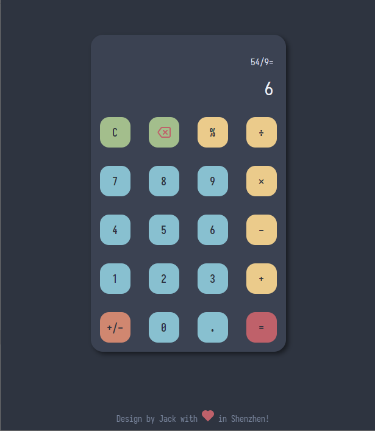

# JsCalc

Just a calculator base on javascript html and css.

## Preview

## Instruction

Download and open `index.html` to run.

I use `draw.io` vscode version to design the flow chart and it is in the `design` document, you can check it if you know chinese.
